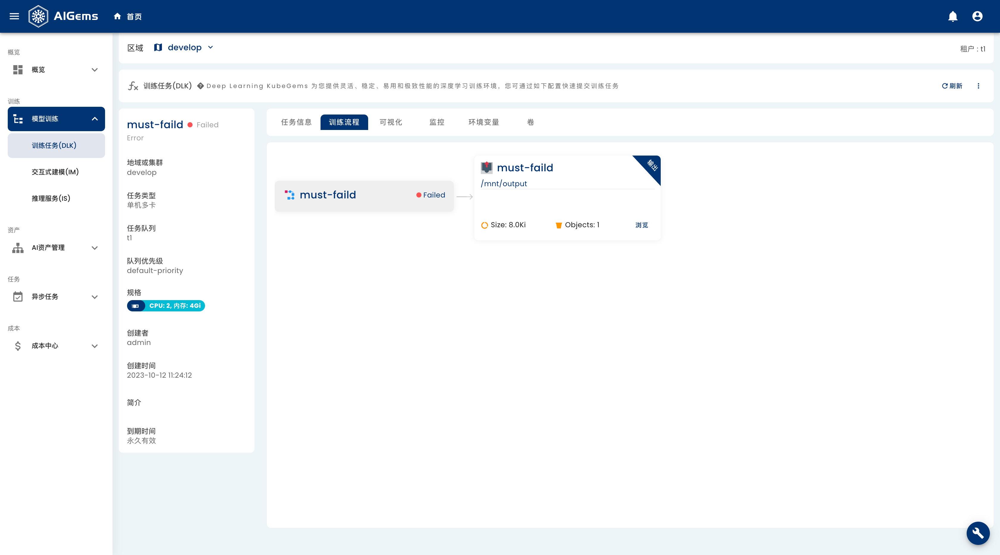

<p align="center">
  <a href="https://github.com/kubegems/pai-console/actions">
    
  </a>
  <a href="https://cn.vuejs.org/">
    
  </a>
  <a href="https://github.com/vuejs/vue">
    
  </a>
  <a title="commitizen" target="_blank" href="http://commitizen.github.io/cz-cli/">
    
  </a>
</p>

<p align="center">
  
</p>

## Introduction

pai-console is the web interface for [KubeGems PAI].

## How to build

### Requirement

#### Node.js

Node.js is required. If you don't have a Node.js development environment, please [set it up](https://nodejs.org/en/download/). The minimum version required is 18.

#### Pnpm

We use [Pnpm](https://pnpm.io/) to do package management. If you don't have pnpm, use the following to install:

```sh
npm install -g pnpm
```

Clone the repository, and run `pnpm && pnpm build`

```sh
git clone https://github.com/kubegems/pai-console.git
cd pai-console/
pnpm && pnpm build
pnpm start
```

## Documentation

To check out [live demo](https://demo.kubegems.io/) and docs, visit [kubegems.io](https://kubegems.io).

## Issues

Please make sure to read the [Issue Template](https://github.com/kubegems/pai-console/blob/main/.github/ISSUE_TEMPLATE.md) and [Pull Request Template](https://github.com/kubegems/pai-console/blob/main/.github/PULL_REQUEST_TEMPLATE.md) before opening an issue or create PR.

## Changelog

Detailed changes for each release are documented in the [release notes](https://github.com/kubegems/pai-console/releases).

### 📑 License

[AGPL-3.0](https://www.gnu.org/licenses/agpl-3.0.en.html)

Copyright (c) 2023-present Kubegems.io
